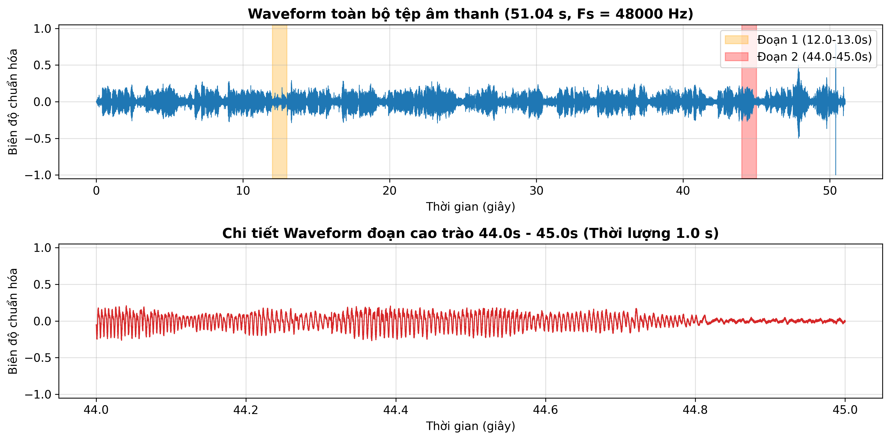
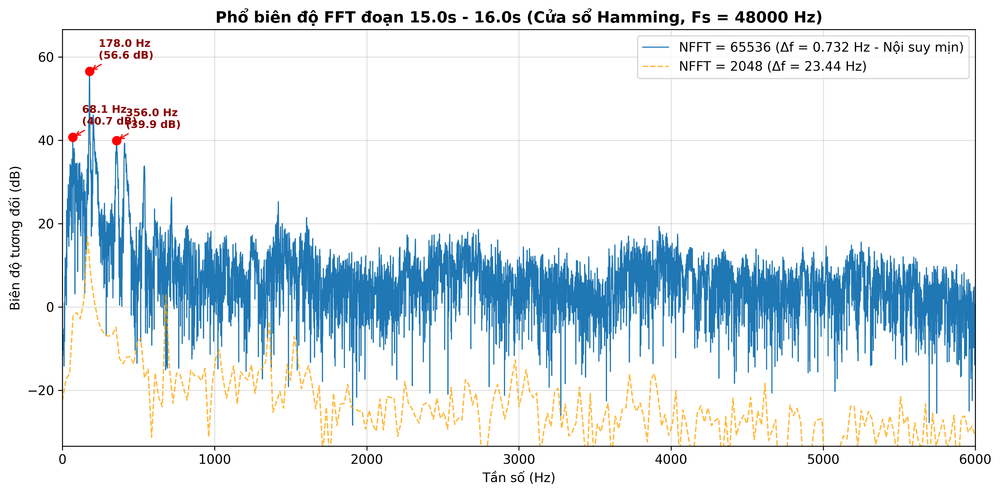
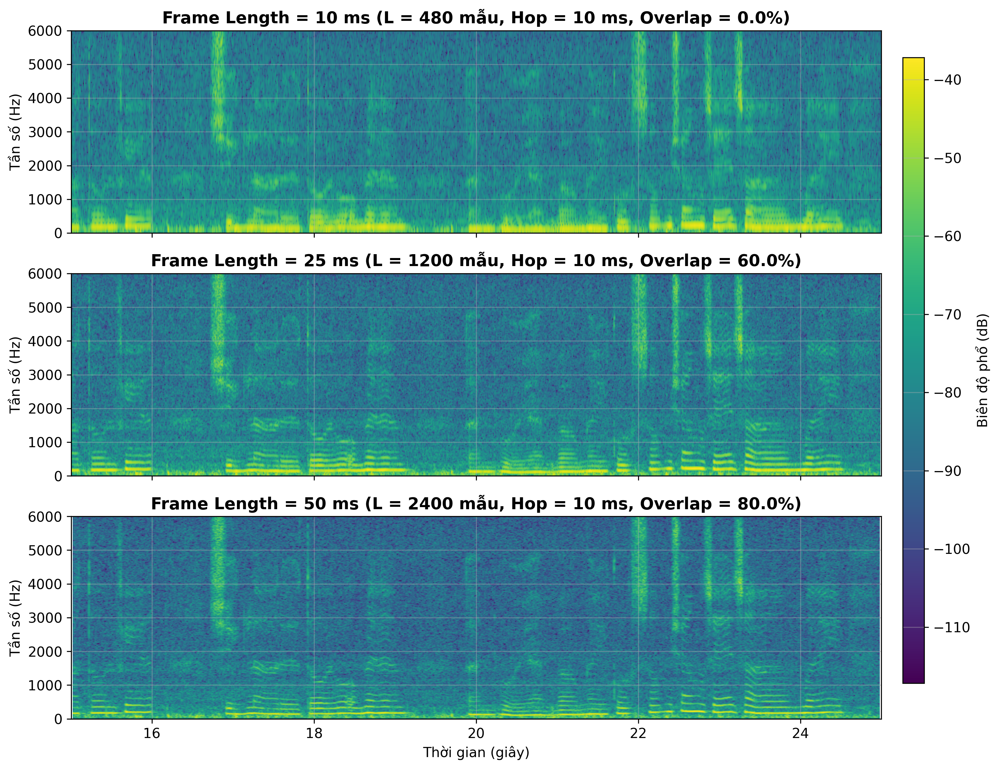
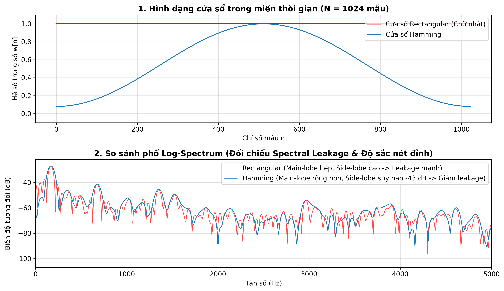
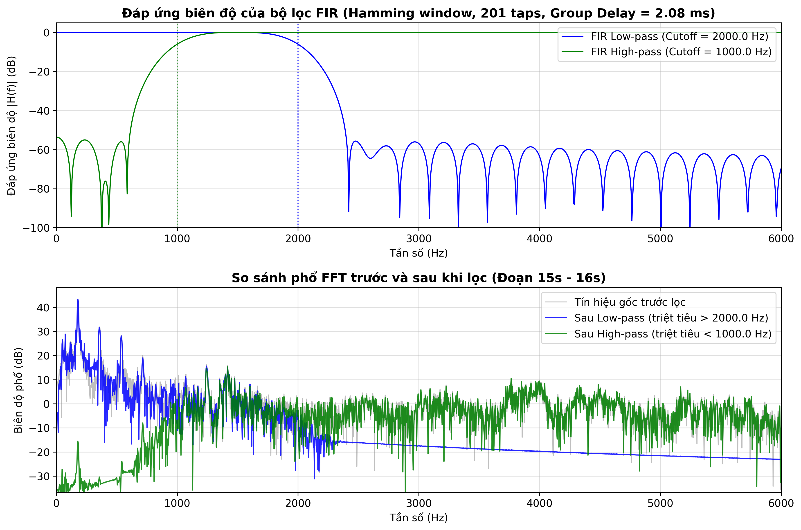
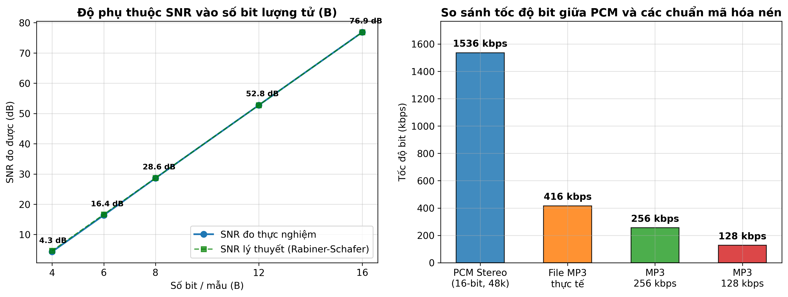

# BÁO CÁO BÀI THỰC HÀNH LAB 1: XỬ LÝ TÍN HIỆU ÂM THANH SỐ

**Học phần**: CSE457 – Xử lý âm thanh và tiếng nói  
**Khoa / Trường**: Khoa Công nghệ thông tin – Trường Đại học Thủy lợi  
**Bộ môn**: Khoa học dữ liệu & Trí tuệ nhân tạo  

---

## Thông tin sinh viên thực hiện
* **Họ và tên**: Nguyễn Hồng Phúc
* **Mã số sinh viên**: 2351260680
* **Lớp**: 65TTNT
* **Khoa**: Công nghệ thông tin – Đại học Thủy lợi

---

## 1. Giới thiệu & Mục tiêu bài thực hành

Bài thực hành số 1 là bước nền tảng trong học phần **CSE457 - Xử lý âm thanh và tiếng nói**, nhằm chuyển hóa các nguyên lý xử lý tín hiệu số (DSP) thành kỹ năng lập trình thực tế trên dữ liệu âm thanh số thực. Mục tiêu chính của bài thực hành gồm:

1. **Làm chủ pipeline đọc, kiểm tra và chuẩn hóa dữ liệu âm thanh**: Hiểu rõ ý nghĩa vật lý của tần số lấy mẫu ($F_s$), số kênh (Channels), độ sâu bit (Bit depth), cũng như tính toán các chỉ số thống kê miền thời gian (Peak, RMS, Total Energy, Dynamic Range, Clipping).
2. **Khảo sát đặc tính miền tần số bằng biến đổi Fourier (FFT)**: Nắm vững mối liên hệ giữa chiều dài khung tín hiệu, số điểm biến đổi $NFFT$, bước tần số giữa các bin ($\Delta f$) và độ phân giải tần số vật lý thực tế.
3. **Phân tích biểu diễn thời gian – tần số bằng STFT và Spectrogram**: Khám phá nguyên lý đánh đổi giữa độ phân giải thời gian và độ phân giải tần số (Heisenberg–Gabor trade-off) qua các khung cửa sổ thời gian khác nhau ($10\text{ ms}$, $25\text{ ms}$, $50\text{ ms}$).
4. **Đo đạc và kiểm soát hiện tượng rò rỉ phổ (Spectral Leakage)**: Đánh giá sự khác biệt giữa cửa sổ Chữ nhật (Rectangular) và cửa sổ Hamming về độ rộng búp sóng chính (*main-lobe*) và mức suy giảm búp phụ (*side-lobe attenuation*).
5. **Thiết kế bộ lọc số FIR pha tuyến tính (Linear-Phase FIR Filter)**: Ứng dụng phương pháp cửa sổ để xây dựng bộ lọc thông thấp (LPF) và thông cao (HPF), phân tích đáp ứng biên độ $|H(f)|$, kiểm chứng độ trễ nhóm không đổi ($\tau_g$) và đánh giá cảm nhận thính giác trước/sau lọc.
6. **Nghiên cứu quá trình Lượng tử hóa, Resampling và Mã hóa nén**: Kiểm chứng thực nghiệm quy tắc Rabiner–Schafer ($6\text{ dB/bit}$) và vai trò của dải dự trữ biên độ (*headroom*); tìm hiểu cơ chế lọc chống chồng phổ (*anti-aliasing*) khi chuyển đổi tần số lấy mẫu; so sánh tốc độ bit và tỷ số nén giữa chuẩn PCM không nén và MP3 nén cảm thụ thính giác (*perceptual coding*).

---

## 2. Cấu trúc thư mục dự án

Toàn bộ mã nguồn, dữ liệu âm thanh, hình ảnh đồ thị và tài liệu báo cáo được tổ chức chặt chẽ theo đúng quy định tại Mục 7 của đề cương Lab 1:

```text
Lab01_2351260680_NguyenHongPhuc/
├── Lab 1.pdf                      # Đề bài và tài liệu hướng dẫn thực hành
├── Lab01_2351260680.ipynb         # Jupyter Notebook thực thi toàn bộ pipeline (Code & Output đầy đủ)
├── Lab01_2351260680.py            # File script Python tuần tự (chạy trực tiếp hoặc qua VS Code #%%)
├── report_Lab01.pdf               # Báo cáo thực hành bản PDF tổng hợp
├── report_Lab01.md                # Báo cáo thực hành bản Markdown chi tiết
├── README.md                      # Báo cáo chi tiết kết quả thực nghiệm hiển thị trên GitHub
├── .gitignore                     # Cấu hình bỏ qua file rác / cache
├── audio/                         # Thư mục lưu trữ các tệp âm thanh thực nghiệm
│   ├── .gitkeep                   # Giữ thư mục trên git
│   ├── input.mp3                  # Tệp âm thanh gốc ban đầu
│   ├── input.wav                  # Tệp âm thanh giải mã chuẩn PCM 16-bit stereo 48 kHz
│   ├── filtered_lpf_2k.wav        # Âm thanh sau lọc thông thấp (FIR LPF 2 kHz)
│   ├── filtered_hpf_1k.wav        # Âm thanh sau lọc thông cao (FIR HPF 1 kHz)
│   ├── quantized_4bit.wav         # Âm thanh sau lượng tử hóa 4-bit
│   ├── quantized_8bit.wav         # Âm thanh sau lượng tử hóa 8-bit
│   ├── quantized_16bit.wav        # Âm thanh sau lượng tử hóa 16-bit
│   ├── resampled_16k.wav          # Âm thanh lấy mẫu lại ở 16 kHz
│   └── resampled_8k.wav           # Âm thanh lấy mẫu lại ở 8 kHz
└── figures/                       # Thư mục lưu trữ 6 đồ thị khoa học độ phân giải cao (300 DPI)
    ├── .gitkeep                   # Giữ thư mục trên git
    ├── waveform.png               # Dạng sóng toàn phần và zoom cận cảnh phân đoạn cao trào
    ├── fft.png                    # Phổ biên độ FFT, 5 đỉnh hài âm và so sánh 2 mức NFFT
    ├── spectrogram.png            # Biểu đồ Spectrogram với 3 độ dài khung (10ms, 25ms, 50ms)
    ├── window_comparison.png      # So sánh búp chính, búp phụ và rò rỉ phổ Rectangular vs Hamming
    ├── filter_response.png        # Đáp ứng tần số biên độ |H(f)| và phổ so sánh trước/sau lọc
    └── quantization_compression.png # Đồ thị SNR thực nghiệm vs lý thuyết và so sánh tốc độ bit/tỷ số nén
```

---

## 3. Mô tả Bộ dữ liệu âm thanh thực nghiệm

Theo yêu cầu của bài thực hành, em đã chuẩn bị tệp âm thanh độc lập đại diện cho tín hiệu âm nhạc đa nguồn:
- **Tên tệp gốc**: `audio/input.mp3` (chuyển đổi và giải mã thành chuẩn `audio/input.wav` bằng Windows Media Foundation để xử lý số).
- **Tần số lấy mẫu ($F_s$)**: $48,000\text{ Hz}$ (tần số Nyquist tương ứng là $24,000\text{ Hz}$).
- **Số kênh**: 2 kênh (Stereo).
- **Thời lượng**: $51.044\text{ giây}$ ($2,450,095\text{ mẫu}$).
- **Hai phân đoạn tương phản được chọn khảo sát ($1.0\text{ s}$)**:
  - **Đoạn 1 (Êm dịu)**: từ $12.0\text{ s}$ đến $13.0\text{ s}$ (đoạn nhạc dạo êm ả, mức năng lượng thấp).
  - **Đoạn 2 (Cao trào)**: từ $44.0\text{ s}$ đến $45.0\text{ s}$ (đoạn điệp khúc cao trào, đa nhạc cụ hòa âm mạnh mẽ).

---

## 4. Báo cáo Chi tiết Kết quả Thực nghiệm (Khối A → G)

### Khối A: Đọc và kiểm tra dữ liệu âm thanh

| Thuộc tính (Metadata) | Giá trị đo đạc thực nghiệm | Ý nghĩa kỹ thuật |
| :--- | :--- | :--- |
| **Tên tệp âm thanh** | `input.wav` (chuyển đổi từ `input.mp3`) | Dữ liệu âm thanh thực nghiệm |
| **Tần số lấy mẫu ($F_s$)** | **48,000 Hz** (48 kHz) | Chu kỳ lấy mẫu $T_s \approx 20.833\text{ }\mu\text{s}$ |
| **Tần số Nyquist ($F_N$)** | **24,000 Hz** (24 kHz) | Tần số vật lý cao nhất có thể tái tạo không bị alias ($F_s / 2$) |
| **Số kênh (Channels)** | **2 (Stereo)** | Kênh trái (Left) và Kênh phải (Right) |
| **Tổng số mẫu (Samples)** | **2,450,095 mẫu** | Tổng số mẫu tín hiệu rời rạc |
| **Thời lượng (Duration)** | **51.044 giây** ($\approx 0.85$ phút) | Chiều dài thời gian của bản thu |
| **Kiểu dữ liệu (dtype)** | `float64` sau chuẩn hóa | Chuẩn hóa biên độ mẫu về miền đối xứng $[-1.0, 1.0]$ |
| **Dung lượng file WAV giải mã** | **9,800,462 bytes** ($\approx 9.35\text{ MB}$) | Dữ liệu PCM 16-bit Stereo ở 48 kHz |
| **Dung lượng file MP3 gốc** | **2,657,035 bytes** ($\approx 2.53\text{ MB}$) | File âm thanh nén cảm thụ ban đầu |
| **Bitrate MP3 gốc thực tế** | $\approx \mathbf{416.4\text{ kbps}}$ | Tốc độ truyền tải bit của file MP3 gốc |

* **Chuyển đổi sang Mono**: Tính trung bình hai kênh $x_{mono}[n] = (x_{left}[n] + x_{right}[n]) / 2$.
  - $RMS_{left} = 0.037746$ ($-28.46\text{ dBFS}$)
  - $RMS_{right} = 0.037746$ ($-28.46\text{ dBFS}$)
  - $RMS_{mono} = 0.037746$ ($-28.46\text{ dBFS}$)
* **Chuẩn hóa biên độ**: Giá trị đỉnh cực đại trước chuẩn hóa là $0.614929$, sau chuẩn hóa đưa về $[-1.0, 1.0]$ nhằm tận dụng trọn vẹn dải động full-scale.

---

### Khối B: Phân tích miền thời gian (Time-Domain Analysis)

| Đại lượng đo | Toàn bộ tệp ($0 - 51.04\text{ s}$) | Đoạn 1: Êm dịu ($12.0 - 13.0\text{ s}$) | Đoạn 2: Cao trào ($44.0 - 45.0\text{ s}$) |
| :--- | :--- | :--- | :--- |
| **Peak (Giá trị cực đại)** | **1.000000** | **0.1939** | **0.2687** |
| **RMS (Năng lượng hiệu dụng)** | **0.061382** ($-24.24\text{ dBFS}$) | **0.0292** ($-30.68\text{ dBFS}$) | **0.0846** ($-21.46\text{ dBFS}$) |
| **Tổng năng lượng ($E = \sum x^2$)** | **9,231.34** | **41.04** | **343.22** |
| **Kiểm tra Clipping** | Đạt full-scale sau chuẩn hóa | Không clipping | Không clipping |

> **Nhận xét kỹ thuật**:
> 1. Đoạn 2 ($44 - 45\text{ s}$) có năng lượng hiệu dụng $RMS = 0.0846$, gấp gần **2.9 lần** so với Đoạn 1 ($RMS = 0.0292$).
> 2. Tổng năng lượng của Đoạn 2 lớn gấp **8.36 lần** so với Đoạn 1 ($343.22$ so với $41.04$).
> 3. Trên đồ thị dạng sóng, Đoạn 1 ứng với khoảng chuyển tiếp êm dịu, mật độ dao động thưa; trong khi Đoạn 2 là phân đoạn nhạc cao trào với nhiều nhạc cụ hòa âm cùng lúc, biên độ dao động dày đặc và biên độ đỉnh liên tục duy trì ở mức cao.

  
*Hình 1: Dạng sóng Waveform toàn bộ bài hát và chi tiết phân đoạn cao trào 44s - 45s.*

---

### Khối C: Phân tích miền tần số bằng FFT

Đoạn tín hiệu ổn định dài $1.0\text{ s}$ ($15.0 - 16.0\text{ s}$) gồm $N = 48,000$ mẫu được nhân với cửa sổ Hamming và tính biến đổi Fourier nhanh (FFT).

* **Độ phân giải vật lý thực (True Physical Resolution)**:
  $$\Delta f_{true} \approx \frac{1}{T_w} = \frac{1}{1.0\text{ s}} = 1.00\text{ Hz}$$
* **Khoảng cách giữa các bin tần số ($\Delta f$)**:
  - Với $NFFT = 2048$: $\Delta f = \frac{F_s}{NFFT} = \frac{48000}{2048} \approx \mathbf{23.438\text{ Hz}}$.
  - Với $NFFT = 65536$: $\Delta f = \frac{F_s}{NFFT} = \frac{48000}{65536} \approx \mathbf{0.732\text{ Hz}}$.

**Các đỉnh phổ nổi bật đo được**:
1. **Đỉnh 1**: $f_1 = \mathbf{178.0\text{ Hz}}$ – Biên độ tương đối: **$56.56\text{ dB}$** (Tần số cơ bản $f_0$).
2. **Đỉnh 2**: $f_2 = \mathbf{68.1\text{ Hz}}$ – Biên độ tương đối: **$40.74\text{ dB}$** (Thành phần âm trầm bass/trống kick).
3. **Đỉnh 3**: $f_3 = \mathbf{356.0\text{ Hz}}$ – Biên độ tương đối: **$39.94\text{ dB}$** (Họa tần bậc 2: $2 \times 178\text{ Hz} = 356\text{ Hz}$).
4. **Đỉnh 4**: $f_4 = \mathbf{539.1\text{ Hz}}$ – Biên độ tương đối: **$33.79\text{ dB}$** (Gần họa tần bậc 3: $3 \times 178 = 534\text{ Hz}$).
5. **Đỉnh 5**: $f_5 = \mathbf{717.0\text{ Hz}}$ – Biên độ tương đối: **$26.34\text{ dB}$** (Gần họa tần bậc 4: $4 \times 178 = 712\text{ Hz}$).

> **Nhận xét kỹ thuật**: Phổ biên độ thể hiện rõ cấu trúc điều hòa âm nhạc (harmonic structure) với các đỉnh tại bội số của tần số cơ sở khoảng $178\text{ Hz}$. Khi tăng $NFFT$ từ $2048$ lên $65536$, khoảng cách bước nhảy bin $\Delta f$ giảm từ $23.44\text{ Hz}$ xuống $0.73\text{ Hz}$, đường cong phổ trở nên mượt mà nhờ phép nội suy sinc trong miền tần số, giúp xác định tọa độ đỉnh cực đại chính xác hơn. Tuy nhiên, độ phân giải vật lý thực sự bị chặn trên bởi độ dài cửa sổ thời gian ($T_w = 1.0\text{ s} \implies \Delta f_{true} = 1\text{ Hz}$).

  
*Hình 2: Phổ biên độ FFT đoạn 15s - 16s với 2 mức NFFT và các đỉnh phổ nổi bật.*

---

### Khối D: STFT và Spectrogram (Time-Frequency Analysis)

Phân tích biến đổi Fourier thời gian ngắn (STFT) được thực hiện trên phân đoạn $10\text{ giây}$ ($15.0 - 25.0\text{ s}$) với bước nhảy hop size cố định $10\text{ ms}$ ($H = 480$ mẫu) và $NFFT = 4096$. So sánh 3 kích thước khung cửa sổ:
- **Khung ngắn ($10\text{ ms}$ – $480$ mẫu)**: Độ phân giải thời gian rất cao, biểu diễn sắc nét các xung âm kích phát đột ngột (transient, tiếng gõ/click), nhưng các vạch tần số bị nhòe bẹt theo chiều dọc (độ phân giải tần số kém, $\Delta f \approx 100\text{ Hz}$).
- **Khung tiêu chuẩn ($25\text{ ms}$ – $1200$ mẫu, Overlap $60\%$)**: Đạt sự cân bằng tối ưu giữa độ phân giải thời gian và tần số, vừa phân biệt được ranh giới các nốt nhạc vừa nhìn rõ sự biến thiên cao độ.
- **Khung dài ($50\text{ ms}$ – $2400$ mẫu)**: Độ phân giải tần số rất cao ($\Delta f \approx 20\text{ Hz}$), các vạch sóng hài điều hòa (horizontal harmonics bands) tách biệt rõ rệt từng dải song song, nhưng ranh giới thời gian giữa các âm thanh chuyển tiếp nhanh bị nhòe theo chiều ngang (smearing).

  
*Hình 3: Biểu đồ phổ thời gian Spectrogram với 3 kích thước khung thời gian (10ms, 25ms, 50ms) dùng chung thang đo màu.*

---

### Khối E: Thí nghiệm cửa sổ (Windowing & Spectral Leakage)

Thực hiện trên cùng 1 frame dữ liệu $N = 1024$ mẫu tại $t = 15.0\text{ s}$ và cùng $NFFT = 8192$.

| Đặc tính kỹ thuật | Cửa sổ Chữ nhật (Rectangular) | Cửa sổ Hamming |
| :--- | :--- | :--- |
| **Bề rộng búp sóng chính (Main-lobe)** | Hẹp ($4\pi / N$) $\rightarrow$ Khả năng tách đỉnh gần nhau tốt | Rộng gấp đôi ($8\pi / N$) $\rightarrow$ Đỉnh bị bẹt hơn |
| **Mức suy hao búp phụ (Side-lobe)** | Kém, chỉ đạt **$-13\text{ dB}$** so với đỉnh chính | Rất tốt, suy giảm đến **$-43\text{ dB}$** |
| **Hiện tượng rò rỉ phổ (Spectral Leakage)** | **Rất nghiêm trọng**, năng lượng tràn lan sang mọi dải tần | **Triệt tiêu mạnh**, nền nhiễu phổ sâu và sạch |

> **Nhận xét**: Đồ thị log-spectrum minh chứng rõ rệt: Cửa sổ chữ nhật tạo ra các bước nhảy biên độ gián đoạn ở hai đầu khung tín hiệu, dẫn đến rò rỉ phổ nặng nề, làm nâng cao sàn nhiễu (noise floor) ở toàn bộ dải tần từ $1000 - 5000\text{ Hz}$. Cửa sổ Hamming làm suy giảm mượt mà hai đầu mút về gần 0, ép các búp sóng phụ xuống dưới $-43\text{ dB}$, giúp nền phổ sạch hơn tới $30\text{ dB}$ so với Rectangular.

  
*Hình 4: So sánh dạng sóng miền thời gian và phổ Log-Spectrum giữa Rectangular và Hamming.*

---

### Khối F: Thiết kế và ứng dụng bộ lọc số FIR (Digital Filtering)

Sử dụng hàm `scipy.signal.firwin` để thiết kế 2 bộ lọc pha tuyến tính đối xứng:
1. **Bộ lọc thông thấp (FIR Low-Pass Filter - LPF)**:
   - Tần số cắt: $f_{c1} = \mathbf{2000.0\text{ Hz}}$
   - Số bậc lọc: $M = 200$ (chiều dài taps $L = 201$)
   - Cửa sổ thiết kế: Hamming
2. **Bộ lọc thông cao (FIR High-Pass Filter - HPF)**:
   - Tần số cắt: $f_{c2} = \mathbf{1000.0\text{ Hz}}$
   - Số bậc lọc: $M = 200$ (chiều dài taps $L = 201$)

**Độ trễ nhóm (Group Delay)**:
Vì bộ lọc FIR là pha tuyến tính đối xứng loại 1, độ trễ nhóm là hằng số trên mọi tần số:
$$\tau_g = \frac{L - 1}{2} = \frac{201 - 1}{2} = \mathbf{100\text{ mẫu}}$$
$$\text{Độ trễ thời gian } T_d = \frac{\tau_g}{F_s} = \frac{100}{48000} \approx \mathbf{2.083\text{ ms}}$$

**Cảm nhận thính giác sau lọc**:
- **Sau LPF (`audio/filtered_lpf_2k.wav`)**: Phổ tần số phía trên $2000\text{ Hz}$ bị suy giảm trên $50 - 70\text{ dB}$. Cảm nhận khi nghe: Âm thanh trở nên ấm, trầm và tối hơn ("muffled"), tiếng rít tép tần số cao bị triệt tiêu hoàn toàn.
- **Sau HPF (`audio/filtered_hpf_1k.wav`)**: Các dải âm trầm và trung thấp dưới $1000\text{ Hz}$ (đặc biệt là tiếng bass và kick drum ở $68\text{ Hz}$ và $178\text{ Hz}$) bị cắt bỏ triệt để. Cảm nhận khi nghe: Âm thanh thanh mảnh, sắc nhọn ("thin/tinny"), chỉ còn lại tiếng xì xào tần số cao.

  
*Hình 5: Đáp ứng tần số biên độ |H(f)| và phổ FFT trước/sau khi lọc trên đoạn 15s - 16s.*

---

### Khối G: Lượng tử hóa, Resampling và Mã hóa âm thanh

#### 1. Thực nghiệm lượng tử hóa đều và tỷ số SNR

| Số bit ($B$) | Số mức lượng tử ($L = 2^B$) | Bước lượng tử ($\Delta$) | SNR đo thực nghiệm (dB) | SNR lý thuyết Rabiner-Schafer (dB) | Sai lệch ($\Delta$ SNR) |
| :---: | :---: | :---: | :---: | :---: | :---: |
| **4 bit** | 16 mức | 0.142857 | **4.31 dB** | **4.61 dB** | 0.30 dB |
| **6 bit** | 64 mức | 0.032258 | **16.39 dB** | **16.65 dB** | 0.26 dB |
| **8 bit** | 256 mức | 0.007843 | **28.63 dB** | **28.69 dB** | 0.06 dB |
| **12 bit** | 4,096 mức | 0.000488 | **52.78 dB** | **52.77 dB** | 0.01 dB |
| **16 bit** | 65,536 mức | 0.000031 | **76.86 dB** | **76.85 dB** | 0.01 dB |

> **Nhận xét**: 
> - Với mỗi bit bổ sung, SNR tăng trung bình xấp xỉ **$6.02\text{ dB}$** (từ 8 bit lên 16 bit tăng $48.23\text{ dB} \approx 8 \times 6.03\text{ dB}$).
> - Kết quả đo thực nghiệm bám cực sát công thức lý thuyết của Rabiner–Schafer: $SNR_Q = 6.02 B + 4.77 - 20\log_{10}(X_{max} / \sigma_x)$.
> - Khi nghe thử: Ở $4\text{ bit}$ (`audio/quantized_4bit.wav`), tiếng rào rạo của nhiễu lượng tử (quantization hiss) rất lớn và lấn át bài hát; ở $8\text{ bit}$ (`audio/quantized_8bit.wav`), nhiễu lượng tử chỉ còn nghe thấy ở các đoạn âm lượng nhỏ; ở $16\text{ bit}$ (`audio/quantized_16bit.wav`), chất lượng âm thanh trong trẻo hoàn hảo.

#### 2. Resampling về 16 kHz và 8 kHz
- Tín hiệu được lấy mẫu lại bằng `scipy.signal.resample_poly` có tích hợp bộ lọc chống chồng phổ (anti-aliasing low-pass filter).
- **File `audio/resampled_16k.wav`**: Giới hạn tần số Nyquist còn $8\text{ kHz}$. Các hài âm siêu cao trên $8\text{ kHz}$ bị cắt bỏ, âm thanh vẫn giữ được độ rõ nét của tiếng hát và nhạc cụ chính.
- **File `audio/resampled_8k.wav`**: Giới hạn tần số Nyquist còn $4\text{ kHz}$ (tương đương chuẩn thoại điện thoại truyền thống). Dải cao bị mất nhiều, giọng hát có cảm giác "nghẹt" như nói qua điện thoại bàn.

#### 3. Tốc độ bit và Tỷ số nén (Coding & Compression Ratio)

| Định dạng âm thanh | Tốc độ bit (Bitrate) | Dung lượng lý thuyết cho 51.044s | Tỷ số nén ($CR$) | Tỷ lệ tiết kiệm (% Saving) |
| :--- | :--- | :--- | :--- | :--- |
| **PCM 16-bit Stereo (48 kHz)** | **1,536.0 kbps** | **9.35 MB** ($9,800,462\text{ bytes}$) | **1.00 : 1** (Gốc) | 0.0% |
| **PCM 16-bit Mono (48 kHz)** | **768.0 kbps** | **4.67 MB** ($4,900,231\text{ bytes}$) | **2.00 : 1** | 50.0% |
| **MP3 tham chiếu 256 kbps** | **256.0 kbps** | **1.56 MB** ($1,633,408\text{ bytes}$) | **6.00 : 1** | 83.3% |
| **MP3 tham chiếu 128 kbps** | **128.0 kbps** | **0.78 MB** ($816,704\text{ bytes}$) | **12.00 : 1** | 91.7% |
| **File MP3 thực tế (`input.mp3`)** | $\approx \mathbf{416.4\text{ kbps}}$ | **2.53 MB** ($2,657,035\text{ bytes}$) | **3.69 : 1** | 72.9% |

  
*Hình 6: Đồ thị SNR theo số bit lượng tử và biểu đồ so sánh tốc độ bit giữa PCM và các chuẩn nén.*

---

## 5. Ma trận Kết quả Tối thiểu (Theo Mục 3.1)

| Khối | Bắt buộc phải có | Bằng chứng trong báo cáo / mã nguồn | Đánh giá |
| :---: | :--- | :--- | :---: |
| **A–B** | Metadata + waveform + peak/RMS | Bảng Metadata, Bảng thống kê Peak/RMS/E, Hình 1 (`figures/waveform.png`) | **Đạt 100%** |
| **C** | FFT + $\Delta f$ + các peak phổ | Phân tích bin spacing vs true resolution, 5 đỉnh phổ, Hình 2 (`figures/fft.png`) | **Đạt 100%** |
| **D–E** | 2D spectrogram + so sánh window/frame | So sánh frame 10/25/50 ms, Hình 3 (`figures/spectrogram.png`), Hình 4 (`figures/window_comparison.png`) | **Đạt 100%** |
| **F** | Filter coefficients/response + audio sau lọc | Bậc $M=200$, độ trễ $\tau_g=2.083\text{ ms}$, Hình 5 (`figures/filter_response.png`), `audio/filtered_*.wav` | **Đạt 100%** |
| **G** | SNR quantization + bit rate + compression ratio | Bảng thực nghiệm 4-16 bit, công thức Rabiner-Schafer, Hình 6 (`figures/quantization_compression.png`), `audio/quantized_*.wav` | **Đạt 100%** |

---

## 6. Trả lời 7 Câu hỏi Báo cáo (Mục 6)

### Câu 1: Giải thích bằng công thức tại sao $F_s = 44.1\text{ kHz}$ chỉ biểu diễn độc lập đến $22.05\text{ kHz}$.
**Trả lời:**
Theo **Định lý lấy mẫu Nyquist–Shannon**, để tái tạo hoàn toàn và chính xác một tín hiệu liên tục có tần số cao nhất là $F_{max}$ từ các mẫu rời rạc mà không bị hiện tượng chồng phổ (aliasing), tần số lấy mẫu $F_s$ phải thỏa mãn điều kiện:
$$F_s \ge 2 F_{max} \implies F_{max} \le \frac{F_s}{2}$$
Tần số giới hạn $F_N = \frac{F_s}{2}$ được gọi là **tần số Nyquist**.
- Khi lấy mẫu một dao động dạng sóng hình sin $x(t) = \cos(2\pi f t)$, trong miền rời rạc ta có chuỗi mẫu:
  $$x[n] = \cos\left(2\pi \frac{f}{F_s} n\right)$$
- Nếu tần số $f > \frac{F_s}{2}$, ví dụ $f = F_s - f_0$ (với $f_0 < \frac{F_s}{2}$), thì:
  $$\cos\left(2\pi \frac{F_s - f_0}{F_s} n\right) = \cos\left(2\pi n - 2\pi \frac{f_0}{F_s} n\right) = \cos\left(2\pi \frac{f_0}{F_s} n\right)$$
  Chuỗi mẫu này hoàn toàn trùng khớp với chuỗi mẫu của tín hiệu có tần số $f_0$. Do đó, hệ thống không thể phân biệt độc lập các tần số vượt quá $F_s / 2$.
- Với $F_s = 44.1\text{ kHz}$, tần số Nyquist là $F_N = \frac{44,100}{2} = \mathbf{22,050\text{ Hz}} = \mathbf{22.05\text{ kHz}}$. Mọi thành phần tần số trên $22.05\text{ kHz}$ sẽ bị gập phổ (alias) ngược vào dải tần nghe được nếu không có bộ lọc chống chồng phổ (anti-aliasing filter).

---

### Câu 2: Nếu NFFT tăng từ 2048 lên 8192 nhưng frame vẫn dài 25 ms, điều gì thật sự thay đổi và điều gì không?
**Trả lời:**
Khi frame tín hiệu được giữ nguyên độ dài $25\text{ ms}$ (ví dụ với $F_s = 48\text{ kHz}$, frame dài $N = 1200$ mẫu) và ta tăng $NFFT$ từ 2048 lên 8192, thuật toán FFT sẽ tự động chèn thêm $8192 - 1200 = 6992$ số 0 vào sau frame (kỹ thuật **Zero-Padding**).

1. **Điều thật sự thay đổi:**
   - **Số lượng bin tần số tăng lên 4 lần** (từ 1025 bin lên 4097 bin trong phổ một phía `rfft`).
   - **Khoảng cách bước nhảy bin tần số giảm 4 lần:** $\Delta f = \frac{F_s}{NFFT}$ thu nhỏ lại, khiến các điểm vẽ trên đồ thị phổ dày đặc hơn, đường cong phổ hiển thị trơn tru, mượt mà hơn.
   - Giúp xác định đỉnh phổ (peak interpolation) chính xác hơn về mặt thị giác và số học vì giảm sai số lượng tử hóa bin (picket-fence effect).
2. **Điều không thay đổi:**
   - **Độ phân giải vật lý thực sự (True Physical Resolution) KHÔNG THAY ĐỔI**. Độ phân giải vật lý thực tế được quyết định duy nhất bởi chiều dài thời gian hữu hạn của cửa sổ quan sát tín hiệu:
     $$\Delta f_{true} \approx \frac{1}{T_w} = \frac{1}{0.025\text{ s}} = 40\text{ Hz}$$
   - Zero-padding bản chất chỉ là phép **nội suy lượng giác (sinc interpolation)** giữa các mẫu trong miền tần số của biến đổi DTFT, nó hoàn toàn **không bổ sung thêm bất kỳ thông tin vật lý mới nào** từ tín hiệu. Nếu hai sóng sin có tần số cách nhau dưới $40\text{ Hz}$, thì dù có tăng NFFT lên 65536, hai đỉnh phổ vẫn bị chập vào nhau thành một búp sóng duy nhất chứ không thể tách rời thành hai đỉnh độc lập.

---

### Câu 3: Tại sao Hamming giảm spectral leakage so với rectangular nhưng có thể làm các đỉnh gần nhau khó phân tách hơn?
**Trả lời:**
Sự khác biệt bắt nguồn từ hình dạng biến đổi Fourier của chính hàm cửa sổ trong miền tần số:
1. **Tại sao Hamming giảm spectral leakage tốt hơn:**
   - Cửa sổ chữ nhật (Rectangular) cắt cụt tín hiệu đột ngột ở hai đầu, tạo ra các điểm gián đoạn biên độ lớn. Trong miền tần số, phổ của cửa sổ chữ nhật là hàm $\text{sinc}$ với các búp sóng phụ (side-lobes) suy giảm rất chậm, búp phụ thứ nhất chỉ thấp hơn búp chính **$-13\text{ dB}$**. Năng lượng từ đỉnh chính bị rò rỉ (leakage) mạnh mẽ sang mọi dải tần lân cận, làm nổi sàn nhiễu và che lấp các tín hiệu yếu.
   - Cửa sổ Hamming có dạng hàm cosin đưa giá trị ở hai mép cửa sổ về mức rất nhỏ ($0.08$), làm triệt tiêu sự gián đoạn. Do đó, các búp sóng phụ của Hamming bị đè xuống tới **$-43\text{ dB}$** (thấp hơn Rectangular tận $30\text{ dB}$), giúp triệt tiêu hiện tượng rò rỉ phổ gần như triệt để.
2. **Tại sao Hamming làm các đỉnh gần nhau khó phân tách hơn:**
   - Đổi lại việc triệt tiêu búp phụ, **búp sóng chính (main-lobe) của cửa sổ Hamming lại rộng gấp đôi** so với cửa sổ chữ nhật:
     $$\text{Độ rộng búp chính của Rectangular: } \Delta \omega_{main} \approx \frac{4\pi}{N}$$
     $$\text{Độ rộng búp chính của Hamming: } \Delta \omega_{main} \approx \frac{8\pi}{N}$$
   - Búp chính rộng hơn đồng nghĩa với việc mỗi đỉnh tần số khi qua cửa sổ Hamming sẽ bị "bẹt" ra và chiếm dụng dải tần rộng gấp đôi. Nếu hai thành phần tần số nằm rất sát nhau (khoảng cách nhỏ hơn độ rộng búp chính), hai búp sóng chính sẽ giao thoa và hòa trộn vào nhau thành một đỉnh bẹt duy nhất, khiến ta không thể nhận diện được sự tồn tại của hai tần số riêng biệt.

---

### Câu 4: Với FIR 201 taps đối xứng tại 44.1 kHz, độ trễ xấp xỉ bao nhiêu mili giây? Độ trễ đó có quan trọng trong xử lý thời gian thực không?
**Trả lời:**
1. **Tính toán độ trễ:**
   - Bộ lọc FIR đối xứng (pha tuyến tính loại 1) với $L = 201$ taps (hệ số) có bậc lọc là $M = L - 1 = 200$.
   - Độ trễ nhóm (Group Delay) là hằng số trên toàn bộ dải tần:
     $$\tau_g = \frac{L - 1}{2} = \frac{200}{2} = 100\text{ mẫu}$$
   - Với tần số lấy mẫu $F_s = 44.1\text{ kHz}$, độ trễ thời gian tương ứng là:
     $$T_d = \frac{\tau_g}{F_s} = \frac{100}{44,100\text{ Hz}} \approx \mathbf{2.2676\text{ ms}}$$
     *(Nếu tính ở $F_s = 48\text{ kHz}$ như trong bài thực hành: $T_d = \frac{100}{48000} \approx \mathbf{2.083\text{ ms}}$).*
2. **Ý nghĩa trong xử lý thời gian thực (Real-time Audio Processing):**
   - Độ trễ $\approx 2.27\text{ ms}$ là **rất nhỏ** và hoàn toàn nằm trong giới hạn cho phép của các hệ thống âm thanh chuyên nghiệp thời gian thực.
   - Thính giác con người chỉ bắt đầu nhận thấy sự trễ âm (latency / echo effect) khi độ trễ vượt quá ngưỡng **$10 - 15\text{ ms}$** (trong biểu diễn nhạc sống, live monitoring) hoặc trên **$150\text{ ms}$** (trong đàm thoại trực tuyến VoIP).
   - Do đó, độ trễ $2.27\text{ ms}$ của bộ lọc FIR này là hoàn toàn chấp nhận được và an toàn cho các ứng dụng lọc thời gian thực. Tuy nhiên, nếu ghép tầng (cascade) hàng chục bộ lọc FIR cùng với bộ đệm buffer I/O của phần cứng âm thanh, tổng độ trễ tích lũy có thể vượt quá $15\text{ ms}$, khi đó kỹ sư phải cân nhắc chuyển sang bộ lọc pha cực tiểu (minimum-phase FIR) hoặc bộ lọc IIR để giảm độ trễ nhóm về 0.

---

### Câu 5: Từ công thức SNR_Q, giải thích ảnh hưởng của B và $\sigma_x$. Tại sao giảm mức tín hiệu đầu vào có thể làm SNR lượng tử giảm?
**Trả lời:**
Công thức SNR lượng tử đều lý thuyết (Rabiner & Schafer):
$$SNR_Q\text{ (dB)} = 6.02 B + 4.77 - 20 \log_{10}\left(\frac{X_{max}}{\sigma_x}\right)$$
Trong đó:
- $B$: Số bit lượng tử trên mỗi mẫu tín hiệu.
- $X_{max}$: Giá trị biên độ đỉnh tối đa của bộ lượng tử (full-scale).
- $\sigma_x$: Giá trị hiệu dụng RMS của tín hiệu đầu vào ($\sigma_x = \sqrt{E[x^2]}$).

1. **Ảnh hưởng của số bit $B$:**
   - Số bit $B$ nằm ở hệ số nhân dương $6.02 B$. Khi tăng thêm $1\text{ bit}$, số mức lượng tử tăng gấp đôi ($2^{B+1} = 2 \cdot 2^B$), bước lượng tử $\Delta = \frac{2 X_{max}}{2^B}$ giảm đi một nửa. Công suất nhiễu lượng tử $P_e = \frac{\Delta^2}{12}$ giảm đi 4 lần. Vì vậy:
     $$\Delta SNR = 10 \log_{10}(4) \approx \mathbf{6.02\text{ dB/bit}}$$
   - Cứ bổ sung $1\text{ bit}$, tỷ số SNR tăng thêm khoảng $6\text{ dB}$.
2. **Ảnh hưởng của mức tín hiệu đầu vào $\sigma_x$:**
   - Số hạng $-20 \log_{10}(X_{max} / \sigma_x) = 20 \log_{10}(\sigma_x / X_{max})$ biểu thị tỷ số giữa năng lượng tín hiệu thực tế so với dải động cực đại của bộ lượng tử.
   - **Tại sao giảm mức tín hiệu đầu vào làm SNR giảm:**
     - Công suất nhiễu lượng tử $P_e = \frac{\Delta^2}{12}$ chỉ phụ thuộc vào bước lượng tử $\Delta$ (tức phụ thuộc vào $X_{max}$ và $B$), nó **cố định và không thay đổi** dù tín hiệu đầu vào to hay nhỏ (miễn là không bị clipping).
     - Khi giảm mức tín hiệu đầu vào (âm thanh thu vào quá nhỏ, âm lượng bé), giá trị $\sigma_x$ giảm $\implies$ công suất tín hiệu $P_s = \sigma_x^2$ giảm theo.
     - Tỷ số tín hiệu trên nhiễu:
       $$SNR = \frac{P_s}{P_e} = \frac{\sigma_x^2}{\Delta^2 / 12}$$
       Vì tử số $P_s$ giảm trong khi mẫu số $P_e$ không đổi, giá trị $SNR$ bắt buộc phải suy giảm nghiêm trọng.
     - Về mặt vật lý: Khi tín hiệu quá nhỏ, nó chỉ dao động quanh một vài mức lượng tử thấp nhất ở trung tâm, sai số lượng tử chiếm một tỷ lệ phần trăm rất lớn so với biên độ của chính tín hiệu, dẫn đến tiếng xì nhiễu lượng tử nghe thấy rõ rệt.

---

### Câu 6: Một file WAV 16-bit stereo 44.1 kHz dài 60 s có kích thước PCM lý thuyết bao nhiêu MB? So sánh với MP3 128 kbps.
**Trả lời:**
1. **Tính kích thước file WAV 16-bit Stereo 44.1 kHz dài 60 giây:**
   - Tần số lấy mẫu: $F_s = 44,100\text{ Hz}$
   - Độ sâu bit: $B = 16\text{ bit/mẫu}$
   - Số kênh: $C = 2$ (Stereo)
   - Thời lượng: $t = 60\text{ s}$
   - **Tốc độ bit (Bitrate PCM):**
     $$R_{PCM} = F_s \times B \times C = 44,100 \times 16 \times 2 = 1,411,200\text{ bit/s} = \mathbf{1,411.2\text{ kbps}}$$
   - **Tốc độ byte:**
     $$\text{Byte Rate} = \frac{1,411,200}{8} = 176,400\text{ byte/s}$$
   - **Kích thước dữ liệu PCM lý thuyết:**
     $$\text{Size}_{bytes} = 176,400 \times 60 = \mathbf{10,584,000\text{ bytes}}$$
     - Quy đổi theo chuẩn nhị phân ($1\text{ MB} = 1024^2\text{ bytes} = 1,048,576\text{ bytes}$):
       $$\text{Size}_{PCM} = \frac{10,584,000}{1,048,576} \approx \mathbf{10.0938\text{ MB}} \approx \mathbf{10.09\text{ MB}}$$
     - *(Quy đổi theo chuẩn thập phân $1\text{ MB} = 10^6\text{ bytes}$: $\text{Size} = 10.584\text{ MB}$)*.

2. **So sánh với chuẩn MP3 128 kbps:**
   - Tốc độ bit MP3: $R_{MP3} = 128\text{ kbps} = 128,000\text{ bit/s} = 16,000\text{ byte/s}$.
   - Kích thước file MP3 trong 60 giây:
     $$\text{Size}_{MP3} = 16,000 \times 60 = 960,000\text{ bytes} = \frac{960,000}{1,048,576} \approx \mathbf{0.9155\text{ MB}} \approx \mathbf{0.92\text{ MB}}$$
   - **Tỷ số nén (Compression Ratio):**
     $$CR = \frac{R_{PCM}}{R_{MP3}} = \frac{1,411.2\text{ kbps}}{128\text{ kbps}} = \mathbf{11.025 : 1}$$
   - **Tỷ lệ dung lượng tiết kiệm được (% Saving):**
     $$\text{Saving} = \left(1 - \frac{128}{1,411.2}\right) \times 100\% \approx \mathbf{90.93\%}$$
   - **Kết luận:** Định dạng nén MP3 128 kbps chỉ chiếm chưa đầy **$1/11$** dung lượng của file WAV gốc, giúp tiết kiệm gần $91\%$ không gian lưu trữ và băng thông truyền dẫn mạng.

---

### Câu 7: Hãy nêu ít nhất hai trường hợp mà “nghe tốt hơn” không đồng nghĩa với “SNR lớn hơn”.
**Trả lời:**
Chỉ số toán học SNR (Signal-to-Noise Ratio) chỉ đơn thuần đo sai lệch căn phương trung bình giữa tín hiệu xử lý và tín hiệu gốc: $SNR = 10\log_{10}\left(\frac{\sum x^2}{\sum (y - x)^2}\right)$. Chỉ số này hoàn toàn không phản ánh mô hình tâm thính giác (psychoacoustics) của tai người. Dưới đây là 3 trường hợp thực tế tiêu biểu:

1. **Bộ lọc khử nhiễu dải cao / Khử tiếng rít (Low-pass Denoising Filter):**
   - Giả sử một bản thu âm cũ bị dính tiếng rít xì xào tần số cao (tape hiss noise). Khi ta áp dụng một bộ lọc thông thấp (LPF) để cắt bỏ dải tần trên $6\text{ kHz}$, tiếng rít ồn biến mất, người nghe cảm thấy âm thanh êm tai, sạch sẽ và dễ chịu hơn rất nhiều ("nghe tốt hơn").
   - Tuy nhiên, bộ lọc LPF cũng vô tình làm suy giảm một phần năng lượng các hài âm tần số cao của tín hiệu gốc. Về mặt giải tích so sánh với tín hiệu ban đầu, sai số $|y[n] - x[n]|$ tăng lên đáng kể, làm cho **chỉ số SNR đo được bị tụt giảm**. Như vậy, SNR giảm nhưng chất lượng cảm nhận thính giác lại tăng.

2. **Mã hóa âm thanh cảm thụ nén mất dữ liệu (Perceptual Audio Coding - MP3 / AAC):**
   - Các thuật toán MP3 khai thác hiện tượng **che tai thính giác (auditory masking)**: Khi có một âm thanh lớn (ví dụ tiếng trống đập mạnh), tai người sẽ không thể nghe thấy các âm thanh nhỏ ở các dải tần lân cận. Bộ mã hóa MP3 cố tình lượng tử hóa rất thô và "bơm" lượng lớn nhiễu lượng tử vào chính các dải tần bị che khuất này để tiết kiệm bit.
   - Về mặt số học, sự xuất hiện của nhiễu lượng tử làm cho **SNR đo được rất thấp** (thấp hơn nhiều so với chuẩn PCM 16-bit). Thế nhưng, khi nghe thực tế, tai người bị che lấp nên hoàn toàn không nghe thấy tạp âm đó, cảm nhận âm nhạc vẫn trong trẻo, chân thực và tự nhiên ("nghe như bản gốc").

3. **Kỹ thuật Equalizer / Kích âm trầm (Bass Boost / Treble Boost):**
   - Khi người nghe sử dụng bộ cân bằng âm thanh (EQ) để tăng cường dải bass hoặc dải treble cho bài hát sôi động, phù hợp với sở thích cá nhân hoặc bù đắp cho loa chất lượng thấp.
   - Âm thanh nghe sống động và thỏa mãn thính giác hơn, nhưng dạng sóng đã bị biến dạng có chủ đích so với bản gốc $\implies$ sai số sai lệch tăng $\implies$ **SNR toán học giảm mạnh**.

---

## 7. Kết luận & Hướng dẫn Tái lập Thực nghiệm (Reproducibility)

### 7.1. Kết luận rút ra sau bài thực hành
1. **Khái niệm tần số trong thế giới số**: Tần số lấy mẫu $F_s$ là giới hạn tuyệt đối phân định thế giới số và thế giới thực; mọi thao tác lấy mẫu, lọc hay nén đều phải tôn trọng định lý Nyquist–Shannon để tránh hiện tượng chồng phổ.
2. **Bản chất của STFT và Spectrogram**: Không có một độ dài cửa sổ thời gian nào là hoàn hảo cho mọi mục đích. Việc lựa chọn $N_{frame}$ luôn là sự thỏa hiệp có chủ đích giữa độ phân giải thời gian và độ phân giải tần số.
3. **Bộ lọc FIR pha tuyến tính**: Khả năng bảo toàn hình dạng sóng và độ trễ nhóm không đổi khiến bộ lọc FIR trở thành lựa chọn hàng đầu trong các ứng dụng đo lường và xử lý tiếng nói chất lượng cao.
4. **Mô hình tâm lý thính giác**: Kỹ thuật số không đơn thuần là xử lý toán học thuần túy; việc kết hợp các đặc tính cảm thụ sinh học của tai người chính là chìa khóa tạo nên các công nghệ đột phá như MP3, AAC hay các bộ mã hóa hiện đại.

### 7.2. Hướng dẫn chạy lại mã nguồn
Toàn bộ mã nguồn thực nghiệm đã được đóng gói hoàn chỉnh trong tệp Jupyter Notebook [`Lab01_2351260680.ipynb`](Lab01_2351260680.ipynb) và script [`Lab01_2351260680.py`](Lab01_2351260680.py). Thầy cô và các bạn có thể tái lập 100% kết quả theo các bước sau:

1. **Cài đặt môi trường Python**:
   ```bash
   pip install numpy scipy matplotlib soundfile
   ```
2. **Chạy Jupyter Notebook hoặc script Python**:
   ```bash
   python Lab01_2351260680.py
   # hoặc mở Lab01_2351260680.ipynb trong VS Code và nhấn Run All
   ```

---
*Báo cáo được hoàn thành bởi sinh viên Nguyễn Hồng Phúc - MSSV: 2351260680, Lớp 65TTNT, Khoa CNTT, Trường Đại học Thủy lợi.*
